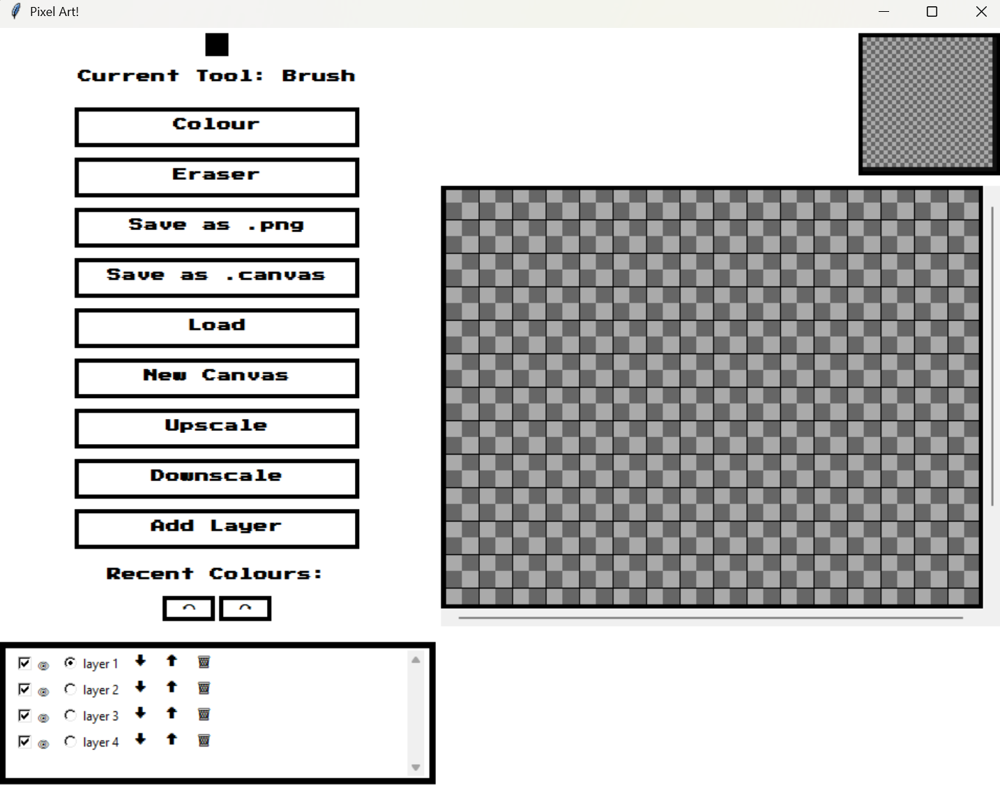

# Pixel Art Editor

A pixel art drawing application built with Python and Tkinter.


## ⚠️ Note

This is an early version and may have bugs and limitations.

## Features

- Multiple layers with visibility controls
- Brush and eraser tools
- Recent colors palette
- Canvas scaling (upscale/downscale)
- Undo/Redo
- Save as .png or .canvas format
- Load existing images

## Download and Run

1. Download the ZIP file from GitHub (Code → Download ZIP)
2. Extract the files
3. Open terminal in the folder
4. Run: `pip install pillow`
5. Run: `python drawing_gui.py`

## Install from PyPI

```bash
pip install pixel-art-editor
pixel-art-editor